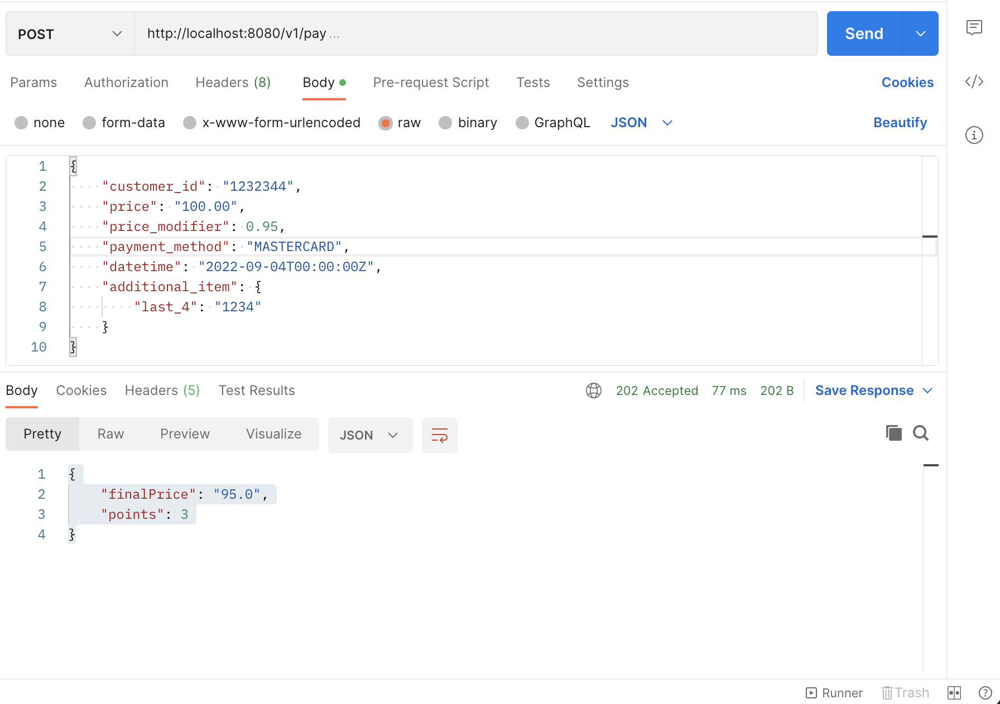
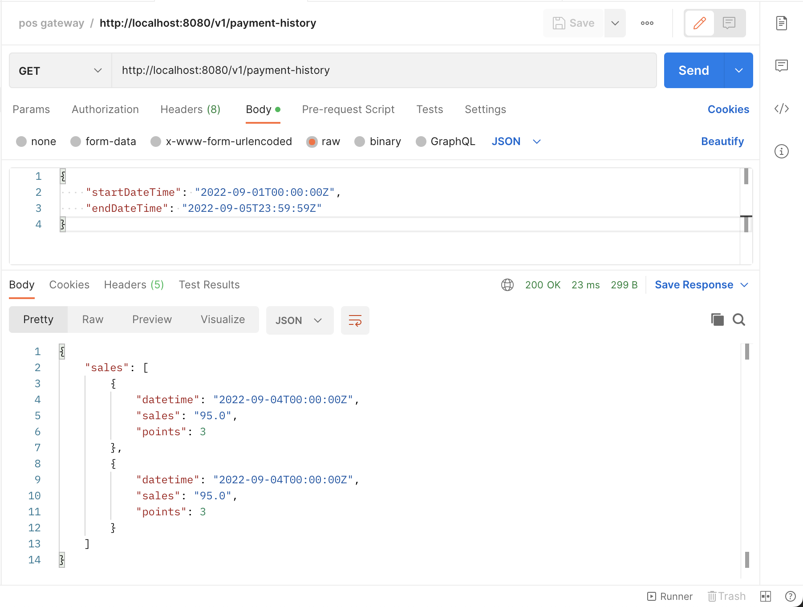
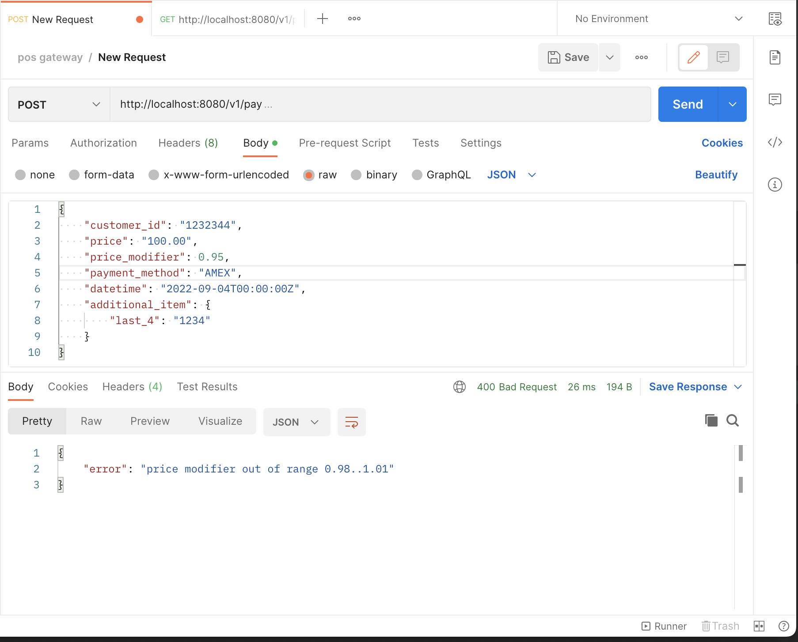

# test-pos-system
### Run
`bootRun` command has been configured to create docker container

and also run the application. Make sure Docker application daemon is running

Run the following command:
```agsl
$ ./gradlew bootRun
```

You can use the postman and make the following request:
```json
{
    "customer_id": "1232344",
    "price": "100.00",
    "price_modifier": 0.95,
    "payment_method": "MASTERCARD",
    "datetime": "2022-09-04T00:00:00Z",
    "additional_item": {
        "last_4": "1234"
    }
}
```

Response
```json
{
    "finalPrice": "95.0",
    "points": 3
}
```

### Screenshots
<p align="center">
  
  
  
</p>


## Improvements:
1. Logging can be made better
2. Add Cache for history API to get regular requests fast